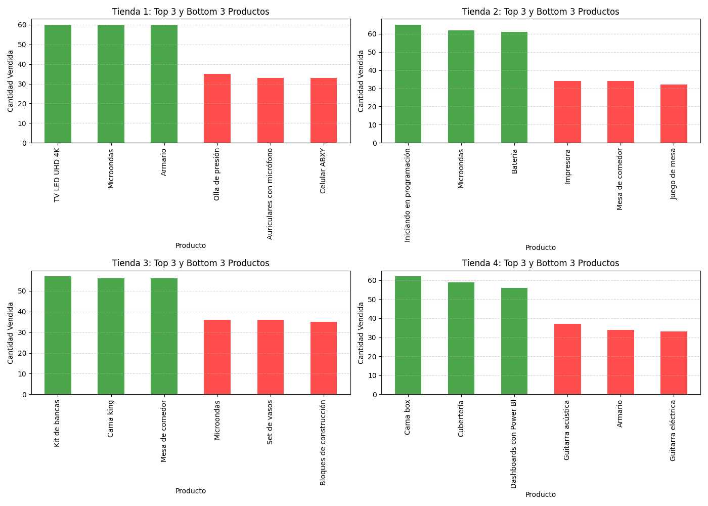
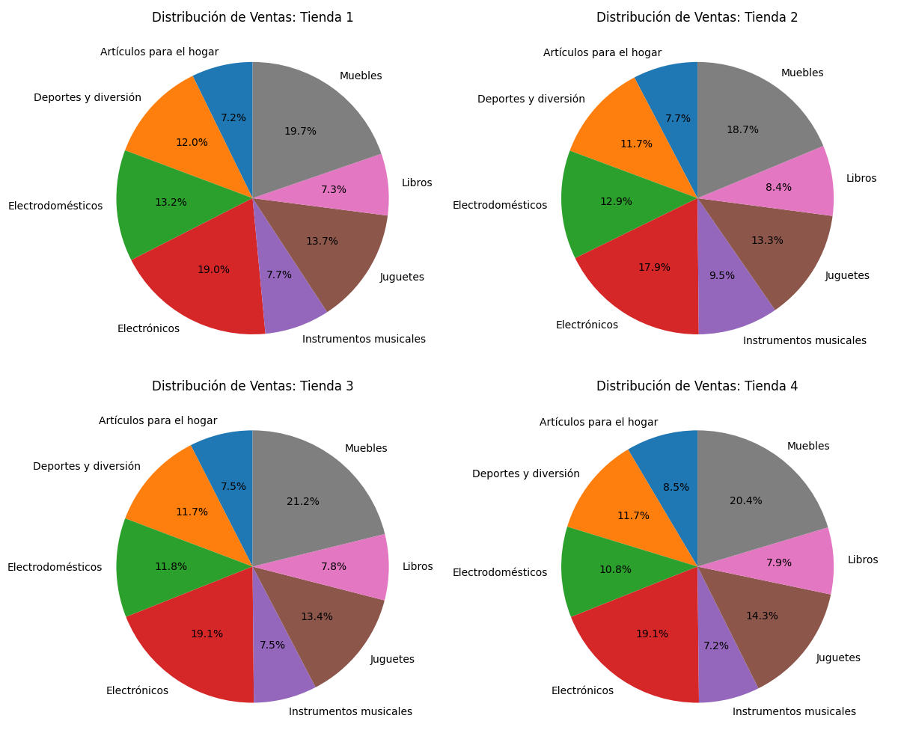
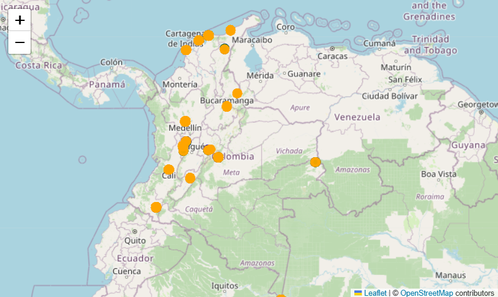

# INFORME FINAL: ANÁLISIS DE RENDIMIENTO Y VENTAS MULTI-TIENDA

**Proyecto:** Análisis de Ventas

---

## 1. OBJETIVO DEL PROYECTO
El propósito principal es ayudar al Sr. Juan a decidir que tienda de su cadena deberia vender. En el análisis se evalua el desempeño comercial de cuatro sucursales distintas, identificando patrones de consumo y distribución geográfica.

**Objetivos específicos:**
* Consolidar la información dispersa de múltiples fuentes (DataFrames).
* Identificar los productos mas y menos vendidos.
* Visualizar la distribución de ventas por categorías.
* Analizar la cobertura geográfica mediante mapas interactivos.

---

## 2. PROCESO TÉCNICO
Para el procesamiento de datos se utilizó Python como herramienta principal.

### A. Herramientas
- **Pandas:** Manipulación y limpieza de datos (Concatenación de DataFrames).
- **Matplotlib:** Visualización estadística.
- **Folium:** Mapeo geoespacial interactivo.

---

## 3. RESULTADOS Y VISUALIZACIONES

### 3.1. Top 3 Productos: Más y Menos Vendidos
Se analizó el rendimiento individual por tienda para identificar oportunidades de inventario.

*(Figura 1: Comparativa de productos con mejor y peor desempeño por sucursal)*

**Observación:** 

### 3.2. Distribución por Categorías
Visualización de la composición de ventas agrupada por tipo de producto.

*(Figura 2: Distribución porcentual de categorías)*

**Observación:** La categoría predominante en todas las sucursales es de la muebles y electrónicos, lo que sugiere que podriamos enfocar las campañas de marketing en este segmento. La categoria menos predominante es la de instrumentos musicales y articulos para le hogar. 

### 3.3. Ingresos totales por tienda

### 3.3. Análisis Geográfico (Mapa de Calor y Ubicación)
Se mapearon las ubicaciones de ventas en Colombia. Dado el solapamiento inicial, se utilizó dispersión para diferenciar las tiendas.

*(Figura 3: Distribución geográfica. Nota: Ver archivo 'mapa_ventas_ruido.html' para interactividad)*

**Hallazgos Geográficos:**
* Existe una clara aglomeración de ventas en el centro del país y ciudades como Bogotá y Medellin. Al igual observamos la nula venta en algunas ciudades del norte como Monteria. 
* Las 4 tiendas compiten directamente en las mismas zonas urbanas.
---

## 4. CONCLUSIONES Y RECOMENDACIONES

1. **Competencia Interna:** La superposición geográfica sugiere que las tiendas podrían estar compitiendo con sus ventas entre sí. Se sugiere diferenciar el inventario por zona.
2. **Inventario:** Se recomienda liquidar el stock de los productos "Bottom 3" mostrados en la Figura 1 para liberar capital.
3. **Estrategia Digital:** Dado el éxito de la categoría Muebles, se debería aumentar la publicidad digital en esa línea.

---
*Fin del informe.*